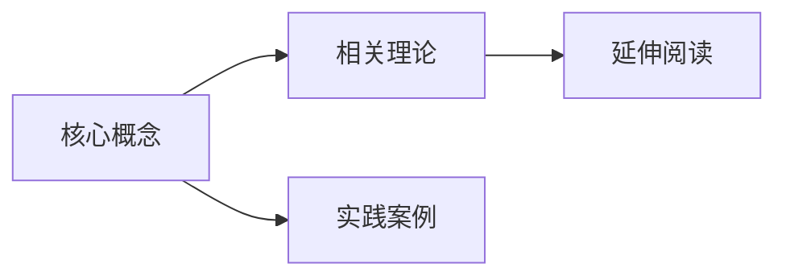

# 为什么你应该使用 Obsidian：知识管理的未来

  
*用关联的思维构建你的第二大脑*

---

## 🔍 Obsidian 是什么？
Obsidian 是一款**本地优先**、**基于Markdown**的双向链接笔记工具，采用**知识图谱**形式组织内容，被称为「数字花园」的终极形态。

---

## ✨ 核心优势

### 1. 🧠 真正属于你的知识库
- **本地存储**：所有数据以纯文本（Markdown）保存在你的设备上
- **零供应商锁定**：即使停止使用，文件依然可读
- **端到端加密**：支持第三方同步方案（如Syncthing）

### 2. 🔗 思维网络构建

### 3. 🛠️ 极致可扩展
- **插件系统**：200+社区插件（日历、看板、OCR等）
- **CSS主题**：完全自定义界面外观
- **API支持**：开发者可深度定制

---

## � 与其他工具的对比

| 特性     | Obsidian  | Notion    |
| -------- | --------- | --------- |
| 本地存储 | ✅         | ❌         |
| 离线使用 | ✅         | ❌         |
| 双向链接 | ✅         | ⚠️         |
| 学习曲线 | 中等      | 低        |
| 价格     | 免费+付费 | 免费+付费 |
---

## 🚀 最适合的使用场景

1. **学术研究**：文献笔记与概念关联
2. **写作创作**：非线性写作工作流
3. **项目管理**：结合Kanban插件
4. **代码文档**：支持代码块高亮
5. **个人知识库**：构建终身学习系统

---

## 💡 使用建议
- 从「每日笔记」开始培养记录习惯
- 善用`[[内部链接]]`建立初始连接
- 定期使用「图谱视图」发现新关联
- 搭配Zotero等工具构建研究系统

> "Obsidian 不是帮你记更多笔记，而是帮你思考得更深入" —— 社区用户评价

---

## 📥 开始使用
官网下载：[obsidian.md](https://obsidian.md)  
推荐插件：  
- Dataview（高级查询）
- Excalidraw（手绘白板）
- Tasks（任务管理）
